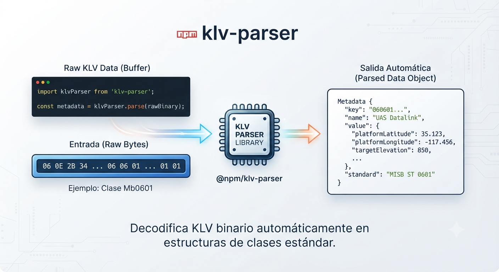

# klv-ts

[](https://www.npmjs.com/package/klv-ts)
[](https://github.com/JuankAnacona/klv-ts/blob/main/LICENSE)
[](https://www.npmjs.com/package/klv-ts)

A modern, high-performance TypeScript parser for SMPTE 336M KLV (Key-Length-Value) packets, with built-in decoding support for MISB ST 0601 metadata. Works seamlessly in both Node.js and browser environments.

---

## KLV Packet Structure

To understand how KLV packets are structured and decoded, refer to the diagram below:



---

## Features

- **Generic SMPTE 336M Parser**: Easily read and parse any standard KLV packet.
- **MISB ST 0601 Decoding**: Built-in, out-of-the-box decoder for UAS Datalink Local Set metadata.
- **Universal Environment Support**: Built for both **Node.js** and the **Browser**.
- **TypeScript First**: Written entirely in TypeScript with full type definitions.
- **Zero Dependencies**: Lightweight and fast, no external runtime dependencies.
- **Tree-shakeable**: Import only what you need to keep your bundle size small.

---

## Installation

Install the package via npm:

```bash
npm install klv-ts
```

Or using pnpm / yarn:

```bash
pnpm add klv-ts
# or
yarn add klv-ts
```

---

## Usage

Here are some examples of how to use `klv-ts` in your project, based on the library's actual API.

### 1. Parsing MISB ST 0601 Metadata (UAS Datalink Local Set)

If your KLV stream contains MISB ST 0601 metadata, you can parse it directly. The parser automatically detects the key and decodes the inner local set.

```typescript
import { Klv } from "klv-ts";

// Example byte array containing a MISB KLV packet (UAS Local Set Key + Length + Value)
const bytes = new Uint8Array([
    0x06,
    0x0e,
    0x2b,
    0x34,
    0x02,
    0x0b,
    0x01,
    0x01,
    0x0e,
    0x01,
    0x03,
    0x01,
    0x01,
    0x00,
    0x00,
    0x00, // UAS Key
    0x12, // Length of the Local Set
    0x02,
    0x08,
    0x00,
    0x00,
    0x01,
    0x94,
    0xd8,
    0xb6,
    0x2f,
    0x80, // Tag 2: Precision Timestamp
    0x03,
    0x04,
    0x54,
    0x45,
    0x53,
    0x54, // Tag 3: Mission ID ("TEST")
    0x05,
    0x02,
    0x80,
    0x00, // Tag 5: Platform Heading (180 deg)
]);

// Parse the KLV packet to get decoded metadata
const metadata = Klv.parse(bytes);

console.log(metadata.missionId); // "TEST"
console.log(metadata.precisionTimestamp); // 1738802605952n (bigint)
console.log(metadata.platformHeadingAngle); // 180 (degrees)
```

### 2. Parsing Multiple Metadata Packets

If you have a stream or buffer containing multiple KLV packets concatenated, use `Klv.parseAll`:

```typescript
import { Klv } from "klv-ts";

const multiBytes = new Uint8Array([
    /* ... multiple KLV packets ... */
]);
const metadataArray = Klv.parseAll(multiBytes);

for (const metadata of metadataArray) {
    console.log(
        `Mission: ${metadata.missionId}, Heading: ${metadata.platformHeadingAngle}`,
    );
}
```

### 3. Reading Raw KLV Packets (No Decoding)

If you just want to extract the raw key, length, and value (without applying a decoder like MISB), use `Klv.read` or `Klv.readAll`:

```typescript
import { Klv } from "klv-ts";

const bytes = new Uint8Array([
    /* ... KLV packet ... */
]);

// Read a single packet
const packet = Klv.read(bytes);

console.log(packet.key.toHex()); // Hex string of the 16-byte Universal Key
console.log(packet.key.isSmpte()); // true
console.log(packet.length); // length of value in bytes
console.log(packet.value); // Uint8Array containing the raw payload
```

### 4. Custom Decoders

You can register custom decoders to handle other types of KLV keys:

```typescript
import { Klv, KlvPacket } from "klv-ts";

const myCustomDecoder = {
    // Return true if this decoder can handle the given key
    canDecode(key) {
        return key.toHex().startsWith("060e2b34");
    },
    // Decode the packet and return metadata
    decode(packet: KlvPacket) {
        return {
            customField: packet.value[0],
        };
    },
};

// Register the decoder
Klv.register(myCustomDecoder);
```

---

## Supported MISB ST 0601 Fields

Below are some of the parsed fields available on `Misb0601Metadata`:

- `missionId` (string)
- `precisionTimestamp` (bigint)
- `platformHeadingAngle` (number)
- `platformPitchAngle` (number)
- `platformRollAngle` (number)
- `sensorLatitude` / `sensorLongitude` / `sensorTrueAltitude` (number)
- `sensorHorizontalFov` / `sensorVerticalFov` (number)
- `sensorRelativeAzimuthAngle` / `sensorRelativeElevationAngle` / `sensorRelativeRollAngle` (number)
- `targetLocationLatitude` / `targetLocationLongitude` / `targetLocationElevation` (number)
- And more (including automatic fallback to `unknownTag<Id>` for unrecognized tags).

---

## License

This project is licensed under the MIT License. See [LICENSE](LICENSE) for details.
